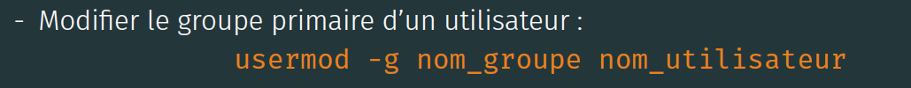
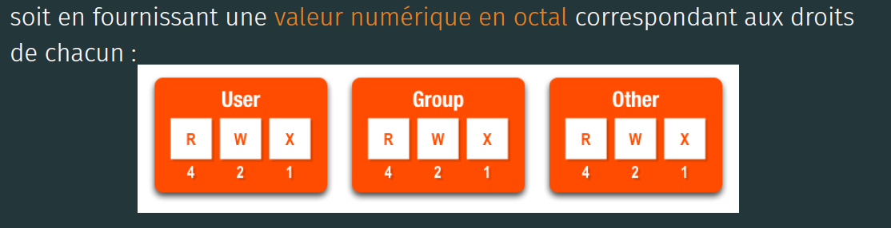

[TP3 :]{.ul}

# Table des matières {#table-des-matières .TOC-Heading}

[Exercice 1 :Gestion des utilisateurs et des groupes :
2](#exercice-1-gestion-des-utilisateurs-et-des-groupes)

[Exercice 2 : Gestion des permissions :
6](#exercice-2-gestion-des-permissions)

# Exercice 1 :Gestion des utilisateurs et des groupes :

{width="5.559705818022747in"
height="3.015152012248469in"}

[Question 1 :]{.ul} Pour cela nous allons utiliser les commandes
suivantes :

-   sudo groupadd dev

-   sudo groupadd infra

[Question 2 :]{.ul} Nous allons pouvoir le faire grâce à la commande
**useradd -m** :

-   sudo useradd -m bob

-   sudo useradd -m alice

-   sudo useradd -m dave

-   sudo useradd -m charlie

[Question 3 :]{.ul} Pour ajouter les utilisateurs dans leur groupes
respectif voici les commandes nécessaires : **usermod -a -G groupe
user**

-   usermod -a -G infra, dev dave

-   usermod -a -G infra, dev bob

-   usermod -a -G dev alice

-   usermod -a -G infra charlie

[Question 4 :]{.ul} Il y a 2 moyens d'afficher les membre d'un groupe :

-   cat /etc/group \| grep nom_groupe

-   getent group infra

[Question 5 :]{.ul} Pour cela nous allons procéder ainsi :

-   sudo chgrp dev /home/alice \| sudo chgrp dev /home/bob

-   sudo chgrp infra /home/charlie \| sudo chgrp infra /home/dave

{width="6.268055555555556in"
height="0.8333333333333334in"}

[Question 6 :]{.ul} Il faut utiliser les commandes suivantes :

-   sudo usermod -g dev alice

-   sudo usermod -g dev bob

-   sudo usermod -g infra charlie

-   sudo usermod -g infra dave

{width="6.268055555555556in"
height="0.6090277777777777in"}

[Question 7 :]{.ul} Pour créer les dossiers :

-   mkdir /home/infra

-   mkdir /home/dev

Pour leur donner les bonnes permissions (c'est-à-dire : tous les droit
pour les user, les groupes mais rien pour les autres 770) :

-   sudo chmod 770 /home/dev

-   sudo chmod 770 /home/infra

{width="6.268055555555556in"
height="1.6090277777777777in"}

[Question 8 :]{.ul} Pour que cela soit possible il faut ajouter le
sticky bit aux permissions du dossier. Il indique que dans ce dossier,
seul le propriétaire d'un fichier, le propriétaire du dossier ou root
ont le droit de renommer ou supprimer ce fichier/dossier.

La commande est la suivante : chmod **1770 /home/infra** et **chmod 1770
/home/dev**

(c'est le 1 devant770 qui spécifie que l'on active le sticky bit)

{width="6.268055555555556in"
height="3.3715277777777777in"}{width="6.268055555555556in"
height="2.5625in"}

[Question 9 :]{.ul} Non cela n'est pas possible car le compte n'est pas
activé.

[Question 10 :]{.ul} Pour activer ce dernier il faut lui configurer un
mot de passe avec la commande **sudo passwd alice** (nous allons lui
assigner le mot de passe 123+alice)

{width="6.268055555555556in"
height="2.997916666666667in"}

[Question 11 :]{.ul} L'UID est l'identifiant utilisateur et le GID est
l'identifiant de groupe. Nous pouvons les obtenir grâce à la commande
suivante : **id nom_user**

Dans notre cas il s'agit d'alice donc : **id alice** 1002

[Question 12 :]{.ul} il faut utiliser **grep « 1003» /etc/passwd**

[Question 13 :]{.ul} Pour connaitre l'id du groupe de nous devons
faire : **grep « dev » /etc/passwd**

Son id est donc 1001.

[Question 14 :]{.ul} C'est le groupe dev qui a pour gid 1002 pour le
vérifier, il faut utiliser la commande : **grep « 1002 » /etc/group**

[Question 15 :]{.ul} L\'utilisateur ne peut pas être retiré car c\'est
son groupe primaire.

[Question 16 :]{.ul}

A\) sudo usermod \--expiredate 01/06/2021 dave

B\) sudo chage -M 90 dave

C\) sudo chage -m 5 dave

D\) sudo chage -W 14 dave

E\) sudo chage -I 30 dave

[Question 17 :]{.ul} Il s'agit de /bin/bash. Pour le savoir nous pouvons
utiliser la commande grep root /etc/passwd

[Question 18 :]{.ul} Ce compte est présent pour exécuter des tâches qui
n'ont pas besoin d'autorisations spéciales (Il est réservé aux services
assez vulnérable)

[Question 19 :]{.ul} La commande sudo conserve notre mot de passe
pendant 15 minutes. Pour forcer sudo à oublier notre mot de passe, il
faut utiliser la commande sudo -k.

# 

# Exercice 2 : Gestion des permissions :

{width="6.268055555555556in"
height="4.852777777777778in"}

[Question 1 :]{.ul} Les droits sur ce fichier sont la lecture et
l'écriture (mais pas l'exécution).

[Question 2 :]{.ul} Afin de retirer les droits nous allons utiliser la
commande **chmod 1000 toto**

Il n'y a plus que root qui peut lire et/ou écrire sur ce fichier toto

[Question 3 :]{.ul} **echo \"Hello\" \> toto** . Sans les droits de
lecture et d\'écriture, il n\'aurait pas été possible de remplacer le
contenu du fichier toto.

[Question 4 :]{.ul} On peut exécuter le fichier en sudo ou en
utilisateur normal, car nous nous sommes donné les droit d'exécution
lors de la question précédente.

[Question 5 :]{.ul} Il est toujours possible d'afficher le contenu du
fichier toto.

[Question 6 :]{.ul} Pour supprimer les droits d'écriture : **chmod 1500
nouveau** et **chmod 1500 sstest** . Nous ne pouvons pas modifier le
texte de façon permanente. Pour remettre les droits d'écriture, il nous
faut les commandes suivantes : **chmod 1700 nouveau** et **chmod 1700
nouveau**. Le droit d'écriture permet de modifier le fichier et
d'enregistrer la ou ls modifications effectuées.

[Question 7 :]{.ul} On peut toujours écrire et lire les fichiers, de lus
on peut toujours lister le contenu du fichier test avec a commande ll.
Nous n'avons retirer que les droits d'exécution.

[Question 8 :]{.ul} je n'ai pas compris quoi faire

[Question 9 :]{.ul} Pour qu'une autre personne d'un groupe est les
droits uniquement d'écriture il faut utiliser la command suivante :
**chmod 1740 toto**

[Question 10 :]{.ul} {width="6.268055555555556in"
height="3.8041666666666667in"}

{width="6.268055555555556in"
height="3.676388888888889in"}

Pour mettre en place les restrictions voulu il faut utiliser la commande
suivante : umask 077 toto

En utilisant la commande **umask -S** , on peut constater les
permissions suivantes :

U=rwx, g= , o=

[Question 11 :]{.ul} Le umask nécessaire pour cette situation est le
suivant :

**Umask 027** u=rwx, g=rx, o=

{width="6.268055555555556in"
height="2.4923611111111112in"}

[Question 12 :]{.ul} Le umask nécessaire pour cette situation est le
suivant :

**Umask 037** u=rwx, g=r, o=

[Question 13 :]{.ul}

1)  chmod u=rx,g=wx,o=r fic

-   Ici l'utilisateur a les droits de lecture et d'exécution, les
    personnes faisant partie du même groupe ont les droits d'écriture et
    d'exécution et les autres ont simplement un droit de lecture. Tout
    cela sur le fichier « fic » .

2)  chmod uo+w,g-rx fic en sachant que les droits initiaux de fic sont
    r\--r-x\-\--

-   Ici on ne modifie pas les droits de l'utilisateur, on ajoute aux
    autres le droit d'écriture et on retire aux personnes du groupe les
    droits de lecture et d'écriture. Tout cela sur le fichier « fic » .

3)  chmod 653 fic en sachant que les droits initiaux de fic sont 71

-   Ici l'utilisateur a les droits de lecture et d'écriture (4+2=6), les
    personnes faisant partie du même groupe ont les droits de lecture et
    d'exécution (4+1=5) et les autres ont les droits d'écriture et
    d'exécution. Tout cela sur le fichier « fic » .

4)  chmod u+x,g=w,o-r fic en sachant que les droits initiaux de fic sont
    r\--r-x\-\--

-   On ajoute l'utilisateur le droit d'exécution, on modifie les droits
    des membre du groupe (passant de lecture + exécution écriture) et on
    retire le droit de lecture aux autres (cependant ces derniers ne le
    possédait pas avant).

[Question 14 :]{.ul} Sur le fichier /etc/passwd les permissions sont les
suivantes :

U=rwx, g= , o= Cela permet seulement aux utilisateur authentifié de
pouvoir consulter/modifier ou exécuter ce fichier.
